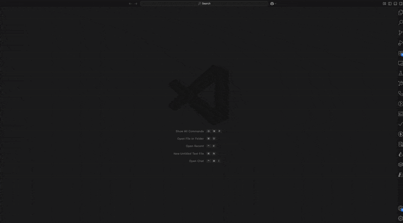
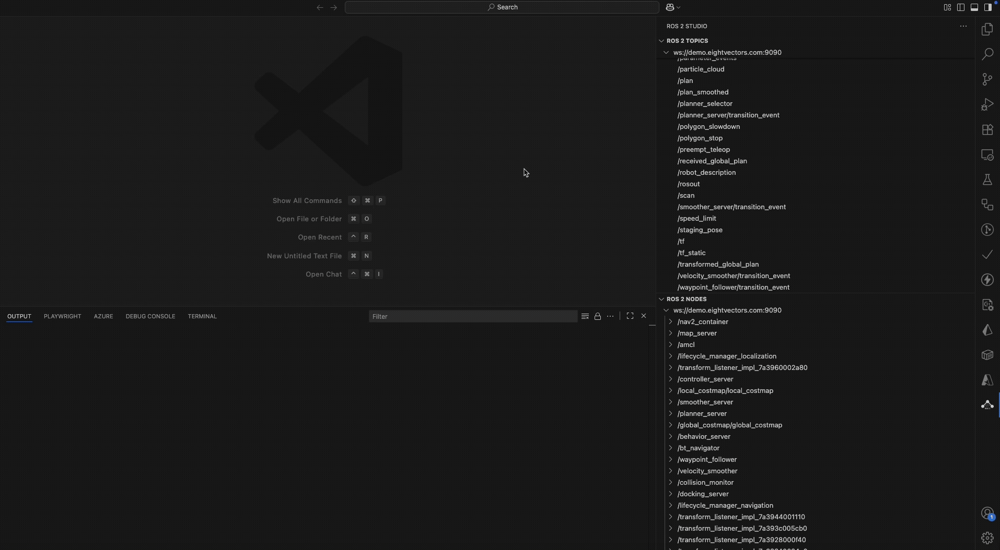
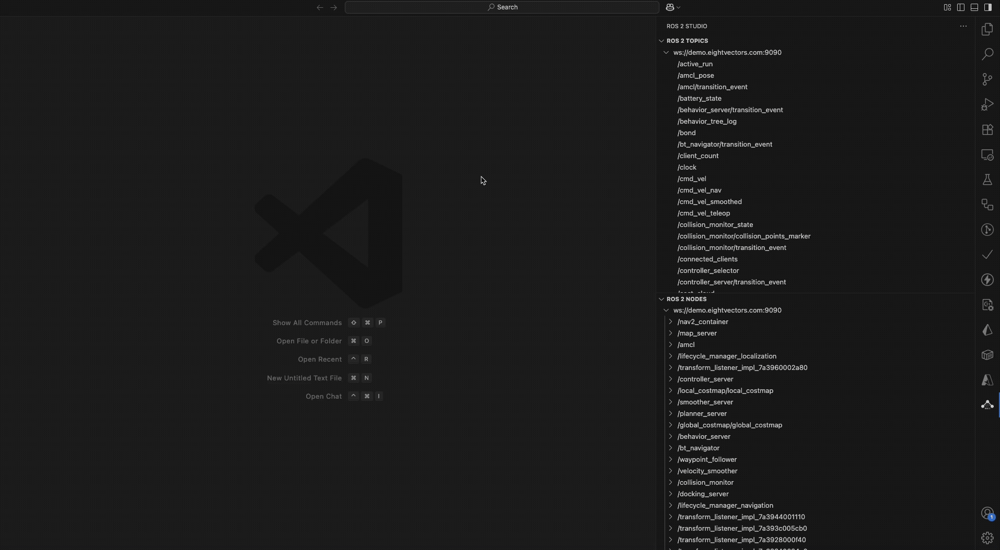
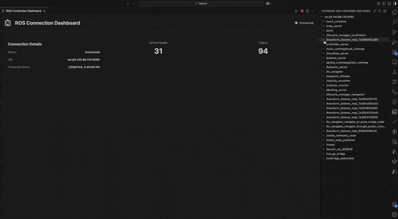
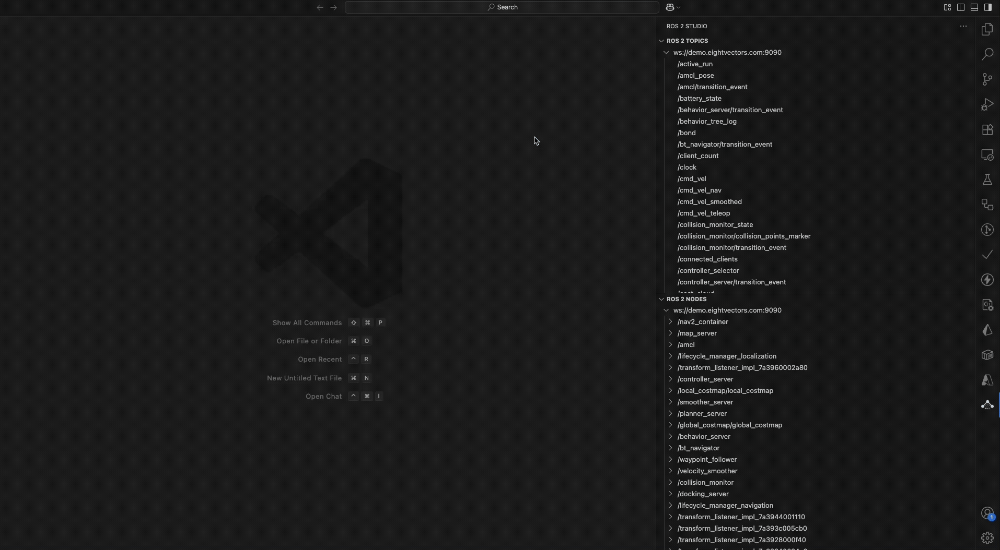
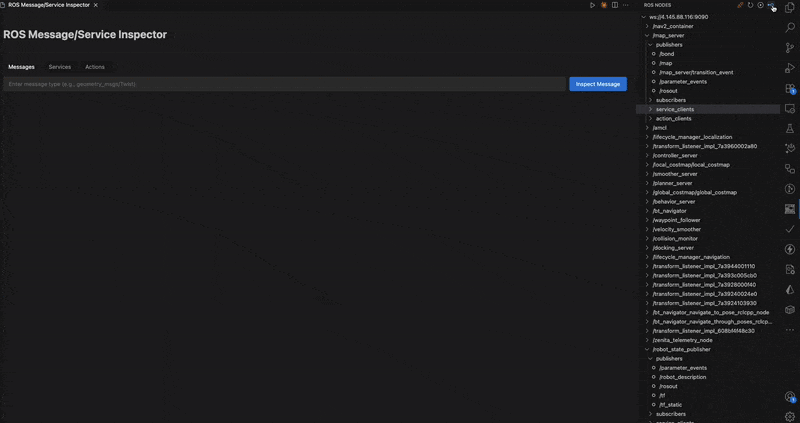

# ROS Bridge Extension for Visual Studio Code

[](https://marketplace.visualstudio.com/items?itemName=eightvectors.vscode-ros-extension)
[](https://opensource.org/licenses/MIT)

Connect to ROS systems via rosbridge WebSocket protocol directly from VS Code. Visualize topics, call services, and interact with ROS nodes without leaving your development environment.

## 🚀 Features

### Core Functionality

- **ROS Entity Discovery** - Browse nodes, topics, services, publishers, and subscribers in a tree view
- **Topic Subscriptions** - Subscribe/unsubscribe to ROS topics with real-time message display
- **Service Calls** - Call ROS services with JSON parameters and view responses
- **WebSocket Connection** - Connect to ROS systems via rosbridge WebSocket protocol

### Advanced Visualization

- **Occupancy Grid Maps** - 2D map visualization with zoom and pan
- **Laser Scan Data** - Real-time laser scan point cloud display
- **URDF Robot Models** - 3D robot visualization with proper coordinate transformations
- Multiple view modes for all visualizations:
  - **Graphical** - Interactive visual representation
  - **Raw Data** - JSON/XML data with syntax highlighting
  - **Both** - Side-by-side graphical and raw data views
- Copy to clipboard functionality for raw data
- Improved scroll handling for streaming data visualization

### Developer Tools

- **Auto-reconnection** - Automatic reconnection to rosbridge on disconnect
- **Configurable Connection** - Custom WebSocket URL configuration
- **Node Parameter Configuration** - View and modify ROS2 node parameters in real-time
- **Bag Recorder Panel** - Select topics and generate ROS2 bag record commands
- **Message/Service/Action Inspector** - Generate JSON templates for ROS message, service, and action types

## 📋 Requirements

- Visual Studio Code 1.93.0 or higher
- ROS system with rosbridge_server running
- WebSocket connection to rosbridge (default: `ws://localhost:9090`)

## 🔧 Installation

### From VS Code Marketplace

1. Open VS Code
2. Go to Extensions (Ctrl+Shift+X)
3. Search for "ROS Bridge Extension"
4. Click Install

## ⚙️ Configuration

### Extension Settings

| Setting                             | Description             | Default               |
| ----------------------------------- | ----------------------- | --------------------- |
| `vscode-ros-extension.rosbridgeUrl` | Rosbridge WebSocket URL | `ws://localhost:9090` |

### Available Commands

| Command               | Description                 | Access                                               |
| --------------------- | --------------------------- | ---------------------------------------------------- |
| `Connect to Remote`   | Connect to rosbridge server | Command Palette / Tree View                          |
| `Disconnect`          | Disconnect from rosbridge   | Context Menu                                         |
| `Refresh connection`  | Refresh ROS entities        | Tree View Button                                     |
| `Subscribe`           | Subscribe to topic          | Context Menu on Publishers                           |
| `Call Service`        | Call a ROS service          | Context Menu on Services                             |
| `Get Parameters`      | View/edit node parameters   | Context Menu on Nodes                                |
| `Add to Bag Recorder` | Add topic to bag recorder   | Context Menu on Topics                               |
| `Open Bag Recorder`   | Open bag recorder panel     | Command Palette                                      |
| `Inspect Type`        | Generate JSON template      | Info icon on hover (Publishers/Subscribers/Services) |

## 📖 Usage

### Getting Started

1. **Start rosbridge** on your ROS system:

   ```bash
   roslaunch rosbridge_server rosbridge_websocket.launch
   ```

2. **Connect to ROS**:

   - Click the robot icon in the activity bar
   - Click "Connect" or use Command Palette: `Connect to Remote`
   - Default connection is `ws://localhost:9090`

   

3. **Browse ROS entities**:

   - Expand the tree to see nodes, topics, and services
   - Right-click for context actions

   

### Visualization Features

1. **Subscribe to a topic** - Right-click on a publisher topic in the ROS tree view and select "Subscribe"
2. **View modes** - When visualization opens, choose between:
   - Graphical view for interactive visualization
   - Raw data view for inspecting message structure
   - Both mode for side-by-side comparison
3. **Copy raw data** - Click the "Copy" button in raw data view to copy the content to clipboard
4. **3D navigation** (URDF models):
   - Mouse drag to rotate
   - Scroll to zoom
   - Right-click drag to pan



### Supported Visualization Types

| Message Type             | Visualization | Description                              |
| ------------------------ | ------------- | ---------------------------------------- |
| `nav_msgs/OccupancyGrid` | 2D Map        | Interactive occupancy grid with zoom/pan |
| `sensor_msgs/LaserScan`  | Point Cloud   | Real-time laser scan visualization       |
| `std_msgs/String` (URDF) | 3D Model      | Robot model with Three.js renderer       |

### Node Parameter Configuration

The extension provides a comprehensive parameter configuration panel for ROS2 nodes:

1. **Access Parameters** - Right-click on any node in the tree view and select "Get Parameters"
2. **Features**:
   - View all node parameters with their current values
   - Edit parameter values with type validation (bool, int, double, string, arrays)
   - Real-time parameter updates
   - Search and filter parameters by name
   - Manual mode for when rosapi is not available
   - Support for complex parameter types including arrays
3. **Parameter Types Supported**:
   - Boolean (dropdown selection)
   - Integer and Double (with automatic type preservation)
   - String values
   - Arrays (JSON format with validation)
   - Read-only display for complex objects



### ROS2 Bag Recorder

The Bag Recorder panel helps you create ROS2 bag recording commands:

1. **Add Topics** - Right-click on any topic and select "Add to Bag Recorder"
2. **Manage Topics**:
   - View all selected topics with their message types
   - Remove individual topics or clear all
   - Topics are displayed with full path and message type information
3. **Generate Command**:
   - Click "Generate Command" to create the `ros2 bag record` command
   - Command includes all selected topics
   - Copy the generated command from the panel
   - Use the command on your ROS2 machine to start recording
4. **Access Panel** - Use Command Palette: "Open Bag Recorder" or right-click topics



### ROS Message/Service/Action Type Inspector

The Message/Service/Action Type Inspector helps developers quickly generate JSON templates for ROS types:

1. **Access Inspector** - Hover over any publisher, subscriber, or service in the tree view and click the info (ⓘ) icon
2. **Features**:
   - Automatically fetches type definition from ROS
   - Generates a complete JSON template with all fields
   - Supports nested message types
   - Handles arrays with example elements
   - Provides type information in comments
   - Includes default values for primitive types
3. **Supported Types**:
   - **Messages** - Generate templates for any ROS message type (from publishers/subscribers)
   - **Services** - Separate templates for request and response
   - **Actions** - Templates for goal, result, and feedback (when available)
4. **Usage**:
   - Copy the generated template to use in service calls or message publishing
   - Modify the values as needed for your use case
   - The template includes all fields with appropriate default values



## 📄 License

This project is licensed under the MIT License - see the [LICENSE](LICENSE) file for details.

## 🏢 About

This extension is developed and maintained by EightVectors. For commercial support and custom development, please contact us at support@eightvectors.com.

## 🐛 Known Issues

- Large message rates may impact performance

## 📮 Support

For issues and feature requests, please use the [GitHub issue tracker](https://github.com/YOUR-USERNAME/vscode-ros-extension/issues).
